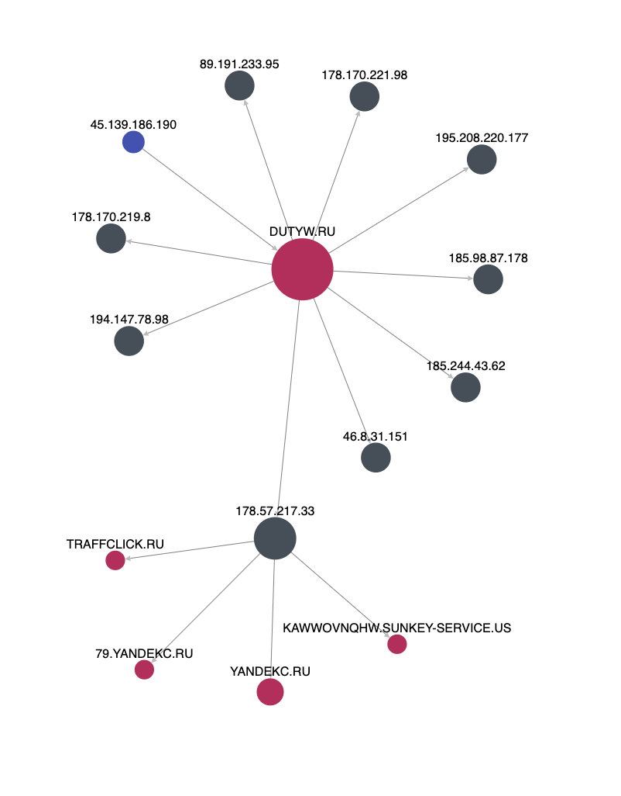

# Ukraine <> Russia Cyber Intelligence Tracker

- **[Introduction](https://github.com/cyware-labs/ukraine-russia-cyber-intelligence/new/main?readme=1#introduction)**
- **[Vulnerabilities Exploited](https://github.com/cyware-labs/ukraine-russia-cyber-intelligence/new/main?readme=1#vulnerabilities-exploited)**
- **[Malware's Used](https://github.com/cyware-labs/ukraine-russia-cyber-intelligence/new/main?readme=1#malwares-used)**
- **[Cyber Groups](https://github.com/cyware-labs/ukraine-russia-cyber-intelligence/new/main?readme=1#cyber-groups)**
- **[MITRE ATT&CK Techniques Used By Threat Actors](https://github.com/cyware-labs/ukraine-russia-cyber-intelligence/new/main?readme=1#mitre-attck-techniques-used-by-threat-actors)**
- **[IOCs](https://github.com/cyware-labs/ukraine-russia-cyber-intelligence/new/main?readme=1#iocs)**
- **[C2C Server Relations](https://github.com/cyware-labs/ukraine-russia-cyber-intelligence/new/main?readme=1#c2c-server-relations)**
- **[Reports & Credits](https://github.com/cyware-labs/ukraine-russia-cyber-intelligence/new/main?readme=1#reports--credits)**
- **[Contribution](https://github.com/cyware-labs/ukraine-russia-cyber-intelligence/new/main?readme=1#contribution)**

## Introduction:

This repository is aimed at curating and tracking threat intelligence published in a single location, enabling defenders to proactively hunt for threats within their environment. Live updates for the same can be seen on Cyware&#39;s own [live page](https://cyware.com/blog/live-updates-russiaukraine-conflict-cyber-threats-and-attacks-3d68).

## Vulnerabilities Exploited:

Below mentioned are the vulnerabilities seen to have been exploited during the crisis

CVE-2021-32648 - [https://nvd.nist.gov/vuln/detail/CVE-2021-32648](https://nvd.nist.gov/vuln/detail/CVE-2021-32648)

CVE-2021-44228 - [https://nvd.nist.gov/vuln/detail/CVE-2021-44228](https://nvd.nist.gov/vuln/detail/CVE-2021-44228)

## Malware's Used:

Below mentioned are the malwares used to attack systems, devices and websites across cyber attacks

TM Feed Hermetic (Wiper)

BlackEnergy (Sandworm Tool 2015)

Industroyer (Sandworm Tool 2016)

NotPetya (Sandworm Tool 2017)

WhisperGate (Wiper)

HermeticWiper / Killdisk.NCV (Wiper)

Cyclops Blink (Sandworm Tool)

VPNFilter (Replaced by Cyclops Blink)

Katana (DDoS Botnet)

## Cyber Groups:

Below mentioned are few of the prominent cyber groups across the Russia <> Ukraine conflict

UNC1151

Gamaredon Group

Anonymous

GhostSec

IT Army of Ukraine

KelvinSecurity Hacking Team

BlackHawk

Raidforums Admin

Netsec

## MITRE ATT&CK Techniques Used By Threat Actors

Below mentioned are some of the MITRE ATT&CK Techniques observed by threat actors involved

| [Domain] | [ID]| Name | Use |
| --- | --- | --- | --- |
| [T1071](https://attack.mitre.org/techniques/T1071) | [0.001](https://attack.mitre.org/techniques/T1071/001) | Application Layer Protocol: Web Protocols | A[Gamaredon Group](https://attack.mitre.org/groups/G0047) file stealer can communicate over HTTP for C2. |
| [T1119](https://attack.mitre.org/techniques/T1119) | [Automated Collection](https://attack.mitre.org/techniques/T1119) | [Gamaredon Group](https://attack.mitre.org/groups/G0047) has deployed scripts on compromised systems that automatically scan for interesting documents |
| [T1020](https://attack.mitre.org/techniques/T1020) | [Automated Exfiltration](https://attack.mitre.org/techniques/T1020) | [Gamaredon Group](https://attack.mitre.org/groups/G0047) has used modules that automatically upload gathered documents to the C2 server |
| [T1547](https://attack.mitre.org/techniques/T1547) | [0.001](https://attack.mitre.org/techniques/T1547/001) | Boot or Logon Autostart Execution: Registry Run Keys / Startup Folder | [Gamaredon Group](https://attack.mitre.org/groups/G0047) tools have registered Run keys in the registry to give malicious VBS files persistence. |
| [T1059](https://attack.mitre.org/techniques/T1059) | [0.003](https://attack.mitre.org/techniques/T1059/003) | Command and Scripting Interpreter: Windows Command Shell | [Gamaredon Group](https://attack.mitre.org/groups/G0047) has used various batch scripts to establish C2 and download additional files.[Gamaredon Group](https://attack.mitre.org/groups/G0047)&#39;s backdoor malware has also been written to a batch file |
| [0.005](https://attack.mitre.org/techniques/T1059/005) | Command and Scripting Interpreter: Visual Basic | [Gamaredon Group](https://attack.mitre.org/groups/G0047) has embedded malicious macros in document templates, which executed VBScript.[Gamaredon Group](https://attack.mitre.org/groups/G0047) has also delivered Microsoft Outlook VBA projects with embedded macros. |
| [T1005](https://attack.mitre.org/techniques/T1005) | [Data from Local System](https://attack.mitre.org/techniques/T1005) | [Gamaredon Group](https://attack.mitre.org/groups/G0047) has collected files from infected systems and uploaded them to a C2 server |
| [T1039](https://attack.mitre.org/techniques/T1039) | [Data from Network Shared Drive](https://attack.mitre.org/techniques/T1039) | [Gamaredon Group](https://attack.mitre.org/groups/G0047) malware has collected Microsoft Office documents from mapped network drives. |
| [T1025](https://attack.mitre.org/techniques/T1025) | [Data from Removable Media](https://attack.mitre.org/techniques/T1025) | A[Gamaredon Group](https://attack.mitre.org/groups/G0047) file stealer has the capability to steal data from newly connected logical volumes on a system, including USB drives. |
| [T1140](https://attack.mitre.org/techniques/T1140) | [Deobfuscate/Decode Files or Information](https://attack.mitre.org/techniques/T1140) | [Gamaredon Group](https://attack.mitre.org/groups/G0047) tools decrypted additional payloads from the C2.[Gamaredon Group](https://attack.mitre.org/groups/G0047) has also decoded base64-encoded source code of a downloader. |
| [T1041](https://attack.mitre.org/techniques/T1041) | [Exfiltration Over C2 Channel](https://attack.mitre.org/techniques/T1041) | A[Gamaredon Group](https://attack.mitre.org/groups/G0047) file stealer can transfer collected files to a hardcoded C2 server. |
| [T1083](https://attack.mitre.org/techniques/T1083) | [File and Directory Discovery](https://attack.mitre.org/techniques/T1083) | [Gamaredon Group](https://attack.mitre.org/groups/G0047) macros can scan for Microsoft Word and Excel files to inject with additional malicious macros.[Gamaredon Group](https://attack.mitre.org/groups/G0047) has also used its backdoors to automatically list interesting files (such as Office documents) found on a system. |
| [T1562](https://attack.mitre.org/techniques/T1562) | [0.001](https://attack.mitre.org/techniques/T1562/001) | Impair Defenses: Disable or Modify Tools | [Gamaredon Group](https://attack.mitre.org/groups/G0047) has delivered macros which can tamper with Microsoft Office security settings. |
| [T1070](https://attack.mitre.org/techniques/T1070) | [0.004](https://attack.mitre.org/techniques/T1070/004) | Indicator Removal on Host: File Deletion | [Gamaredon Group](https://attack.mitre.org/groups/G0047) tools can delete files used during an infection. |
| [T1105](https://attack.mitre.org/techniques/T1105) | [Ingress Tool Transfer](https://attack.mitre.org/techniques/T1105) | Tools used by[Gamaredon Group](https://attack.mitre.org/groups/G0047) are capable of downloading and executing additional payloads |
| [T1559](https://attack.mitre.org/techniques/T1559) | [0.001](https://attack.mitre.org/techniques/T1559/001) | Inter-Process Communication: Component Object Model | [Gamaredon Group](https://attack.mitre.org/groups/G0047) malware can insert malicious macros into documents using a Microsoft.Office.Interop object. |
| [T1534](https://attack.mitre.org/techniques/T1534) | [Internal Spearphishing](https://attack.mitre.org/techniques/T1534) | [Gamaredon Group](https://attack.mitre.org/groups/G0047) has used an Outlook VBA module on infected systems to send phishing emails with malicious attachments to other employees within the organization. |
| [T1112](https://attack.mitre.org/techniques/T1112) | [Modify Registry](https://attack.mitre.org/techniques/T1112) | [Gamaredon Group](https://attack.mitre.org/groups/G0047) has removed security settings for VBA macro execution by changing registry values HKCU\Software\Microsoft\Office\\&lt;version\&gt;\\&lt;product\&gt;\Security\VBAWarnings and HKCU\Software\Microsoft\Office\\&lt;version\&gt;\\&lt;product\&gt;\Security\AccessVBOM. |
| [T1106](https://attack.mitre.org/techniques/T1106) | [Native API](https://attack.mitre.org/techniques/T1106) | [Gamaredon Group](https://attack.mitre.org/groups/G0047) malware has used CreateProcess to launch additional malicious components. |
| [T1027](https://attack.mitre.org/techniques/T1027) | [Obfuscated Files or Information](https://attack.mitre.org/techniques/T1027) | [Gamaredon Group](https://attack.mitre.org/groups/G0047) has delivered self-extracting 7z archive files within malicious document attachments, and used obfuscated or encrypted scripts. |
| [0.001](https://attack.mitre.org/techniques/T1027/001) | [Binary Padding](https://attack.mitre.org/techniques/T1027/001) | [Gamaredon Group](https://attack.mitre.org/groups/G0047) has obfuscated .NET executables by inserting junk code. |
| [0.004](https://attack.mitre.org/techniques/T1027/004) | [Compile After Delivery](https://attack.mitre.org/techniques/T1027/004) | [Gamaredon Group](https://attack.mitre.org/groups/G0047) has compiled the source code for a downloader directly on the infected system using the built-in Microsoft.CSharp.CSharpCodeProvider class. |
| [T1137](https://attack.mitre.org/techniques/T1137) | [Office Application Startup](https://attack.mitre.org/techniques/T1137) | [Gamaredon Group](https://attack.mitre.org/groups/G0047) has inserted malicious macros into existing documents, providing persistence when they are reopened.[Gamaredon Group](https://attack.mitre.org/groups/G0047) has loaded the group&#39;s previously delivered VBA project by relaunching Microsoft Outlook with the /altvba option, once the Application.Startup event is received |
| [T1120](https://attack.mitre.org/techniques/T1120) | [Peripheral Device Discovery](https://attack.mitre.org/techniques/T1120) | [Gamaredon Group](https://attack.mitre.org/groups/G0047) has delivered spearphishing emails with malicious attachments to targets. |
| [T1566](https://attack.mitre.org/techniques/T1566) | [0.001](https://attack.mitre.org/techniques/T1566/001) | Phishing: Spearphishing Attachment | [Gamaredon Group](https://attack.mitre.org/groups/G0047) has delivered spearphishing emails with malicious attachments to targets. |
| [T1053](https://attack.mitre.org/techniques/T1053) | [0.005](https://attack.mitre.org/techniques/T1053/005) | Scheduled Task/Job: Scheduled Task | [Gamaredon Group](https://attack.mitre.org/groups/G0047) has created a scheduled task to launch an executable every 10 minutes. |
| [T1113](https://attack.mitre.org/techniques/T1113) | [Screen Capture](https://attack.mitre.org/techniques/T1113) | [Gamaredon Group](https://attack.mitre.org/groups/G0047)&#39;s malware can take screenshots of the compromised computer every minute. |
| [T1218](https://attack.mitre.org/techniques/T1218) | [0.011](https://attack.mitre.org/techniques/T1218/011) | Signed Binary Proxy Execution: Rundll32 | [Gamaredon Group](https://attack.mitre.org/groups/G0047) malware has used rundll32 to launch additional malicious components. |
| [T1082](https://attack.mitre.org/techniques/T1082) | [System Information Discovery](https://attack.mitre.org/techniques/T1082) | A[Gamaredon Group](https://attack.mitre.org/groups/G0047) file stealer can gather the victim&#39;s computer name and drive serial numbers to send to a C2 server. |
| [T1033](https://attack.mitre.org/techniques/T1033) | [System Owner/User Discovery](https://attack.mitre.org/techniques/T1033) | [System Owner/User Discovery](https://attack.mitre.org/techniques/T1033) |
| [T1080](https://attack.mitre.org/techniques/T1080) | [Taint Shared Content](https://attack.mitre.org/techniques/T1080) | [Gamaredon Group](https://attack.mitre.org/groups/G0047) has injected malicious macros into all Word and Excel documents on mapped network drives. |
| [T1221](https://attack.mitre.org/techniques/T1221) | [Template Injection](https://attack.mitre.org/techniques/T1221) | [Gamaredon Group](https://attack.mitre.org/groups/G0047) has used DOCX files to download malicious DOT document templates.[Gamaredon Group](https://attack.mitre.org/groups/G0047) can also inject malicious macros or remote templates into documents already present on compromised systems. |
| [T1204](https://attack.mitre.org/techniques/T1204) | [0.002](https://attack.mitre.org/techniques/T1204/002) | User Execution: Malicious File | [Gamaredon Group](https://attack.mitre.org/groups/G0047) has attempted to get users to click on Office attachments with malicious macros embedded. |
| [T1102](https://attack.mitre.org/techniques/T1102) | [Web Service](https://attack.mitre.org/techniques/T1102) | [Gamaredon Group](https://attack.mitre.org/groups/G0047) has used GitHub repositories for downloaders which will be obtained by the group&#39;s .NET executable on the compromised system |

## IOCs:

Below mentioned are few of the indicators observed to be involved with exploits and campaigns in the Ukraine <> Russia Conflict

| **Indicator** | **Type** | **Description** |
| --- | --- | --- |
| [a196c6b8ffcb97ffb276d04f354696e2391311db3841ae16c8c9f56f36a38e92](https://www.virustotal.com/gui/file/a196c6b8ffcb97ffb276d04f354696e2391311db3841ae16c8c9f56f36a38e92) | FileHash-SHA256 | Hash of destructive malware stage1.exe |
| [dcbbae5a1c61dbbbb7dcd6dc5dd1eb1169f5329958d38b58c3fd9384081c9b78](https://www.virustotal.com/gui/file/dcbbae5a1c61dbbbb7dcd6dc5dd1eb1169f5329958d38b58c3fd9384081c9b78) | FileHash-SHA256 | Hash of stage2.exe |
| cmd.exe /Q /c start c:\stage1.exe 1\&gt; \\127.0.0.1\ADMIN$\_\_[TIMESTAMP] 2\&gt;&amp;1 | Command line | Example Impacket command line showing the execution of the destructive malware. The working directory has varied in observed intrusions. |
| [licensecheckout.com](https://otx.alienvault.com/indicator/domain/licensecheckout.com) | Hostname | C&amp;C Server Address |
| [45.139.186.190](https://otx.alienvault.com/indicator/ip/45.139.186.190) | IPv4 | C&amp;C Server Address |
| [http://DJVU.SH](https://otx.alienvault.com/indicator/url/http:%2F%2FDJVU.SH) | URL |
| [189166d382c73c242ba45889d57980548d4ba37](https://otx.alienvault.com/indicator/file/189166d382c73c242ba45889d57980548d4ba37e)e | FileHash-SHA1 |
| [16525cb2fd86dce842107eb1ba6174b23f18853](https://otx.alienvault.com/indicator/file/16525cb2fd86dce842107eb1ba6174b23f188537)7 | FileHash-SHA1 | Win32:DropperX-gen\ [Drp] |
| [5d5c99a08a7d927346ca2dafa7973fc](https://otx.alienvault.com/indicator/file/5d5c99a08a7d927346ca2dafa7973fc1)1 | FileHash-MD5 |
| [14c8482f302b5e81e3fa1b18a509289](https://otx.alienvault.com/indicator/file/14c8482f302b5e81e3fa1b18a509289d)d | FileHash-MD5 | Win32:DropperX-gen\ [Drp] |
| [1AVNM68gj6PGPFcJuftKATa4WLnzg8fpfv](https://otx.alienvault.com/indicator/bitcoin-address/1AVNM68gj6PGPFcJuftKATa4WLnzg8fpfv) | Bitcoin Address Used By Ransomeware |
| [fd7eacc2f87aceac865b0aa97a50503d44b799f27737e009f91f3c281233c17d](https://otx.alienvault.com/indicator/file/fd7eacc2f87aceac865b0aa97a50503d44b799f27737e009f91f3c281233c17d) | FileHash-SHA256 |
| [e5f3ef69a534260e899a36cec459440dc572388defd8f1d98760d31c700f42d5](https://otx.alienvault.com/indicator/file/e5f3ef69a534260e899a36cec459440dc572388defd8f1d98760d31c700f42d5) | FileHash-SHA256 |
| [b6f2e008967c5527337448d768f2332d14b92de22a1279fd4d91000bb3d4a0fd](https://otx.alienvault.com/indicator/file/b6f2e008967c5527337448d768f2332d14b92de22a1279fd4d91000bb3d4a0fd) | FileHash-SHA256 |
| [b01e0c6ac0b8bcde145ab7b68cf246deea9402fa7ea3aede7105f7051fe240c1](https://otx.alienvault.com/indicator/file/b01e0c6ac0b8bcde145ab7b68cf246deea9402fa7ea3aede7105f7051fe240c1) | FileHash-SHA256 |
| [96b77284744f8761c4f2558388e0aee2140618b484ff53fa8b222b340d2a9c84](https://otx.alienvault.com/indicator/file/96b77284744f8761c4f2558388e0aee2140618b484ff53fa8b222b340d2a9c84) | FileHash-SHA256 |
| [8c614cf476f871274aa06153224e8f7354bf5e23e6853358591bf35a381fb75b](https://otx.alienvault.com/indicator/file/8c614cf476f871274aa06153224e8f7354bf5e23e6853358591bf35a381fb75b) | FileHash-SHA256 |
| [2c7732da3dcfc82f60f063f2ec9fa09f9d38d5cfbe80c850ded44de43bdb666d](https://otx.alienvault.com/indicator/file/2c7732da3dcfc82f60f063f2ec9fa09f9d38d5cfbe80c850ded44de43bdb666d) | FileHash-SHA256 | research\_pe\_signed\_outside\_timestamp |
| [23ef301ddba39bb00f0819d2061c9c14d17dc30f780a945920a51bc3ba0198a4](https://otx.alienvault.com/indicator/file/23ef301ddba39bb00f0819d2061c9c14d17dc30f780a945920a51bc3ba0198a4) | FileHash-SHA256 | research\_pe\_signed\_outside\_timestamp |
| [1bc44eef75779e3ca1eefb8ff5a64807dbc942b1e4a2672d77b9f6928d292591](https://otx.alienvault.com/indicator/file/1bc44eef75779e3ca1eefb8ff5a64807dbc942b1e4a2672d77b9f6928d292591) | FileHash-SHA256 |
| [0385eeab00e946a302b24a91dea4187c1210597b8e17cd9e2230450f5ece21da](https://otx.alienvault.com/indicator/file/0385eeab00e946a302b24a91dea4187c1210597b8e17cd9e2230450f5ece21da) | FileHash-SHA256 |
| [http://5.182.211.5/rip.sh](https://otx.alienvault.com/indicator/url/http:%2F%2F5.182.211.5%2Frip.sh) | URL |
| [96.80.68.193](https://otx.alienvault.com/indicator/ip/96.80.68.193) | IPv4 |
| [93.51.177.66](https://otx.alienvault.com/indicator/ip/93.51.177.66) | IPv4 |
| [90.63.245.175](https://otx.alienvault.com/indicator/ip/90.63.245.175) | IPv4 |
| [81.4.177.118](https://otx.alienvault.com/indicator/ip/81.4.177.118) | IPv4 |
| [80.155.38.210](https://otx.alienvault.com/indicator/ip/80.155.38.210) | IPv4 |
| [80.153.75.103](https://otx.alienvault.com/indicator/ip/80.153.75.103) | IPv4 |
| [80.15.113.188](https://otx.alienvault.com/indicator/ip/80.15.113.188) | IPv4 |
| [78.134.89.167](https://otx.alienvault.com/indicator/ip/78.134.89.167) | IPv4 |
| [70.62.153.174](https://otx.alienvault.com/indicator/ip/70.62.153.174) | IPv4 |
| [50.255.126.65](https://otx.alienvault.com/indicator/ip/50.255.126.65) | IPv4 |
| [5.182.211.5](https://otx.alienvault.com/indicator/ip/5.182.211.5) | IPv4 |
| [37.99.163.162](https://otx.alienvault.com/indicator/ip/37.99.163.162) | IPv4 |
| [37.71.147.186](https://otx.alienvault.com/indicator/ip/37.71.147.186) | IPv4 |
| [24.199.247.222](https://otx.alienvault.com/indicator/ip/24.199.247.222) | IPv4 |
| [217.57.80.18](https://otx.alienvault.com/indicator/ip/217.57.80.18) | IPv4 |
| [212.234.179.113](https://otx.alienvault.com/indicator/ip/212.234.179.113) | IPv4 |
| [212.202.147.10](https://otx.alienvault.com/indicator/ip/212.202.147.10) | IPv4 |
| [212.103.208.182](https://otx.alienvault.com/indicator/ip/212.103.208.182) | IPv4 |
| [208.81.37.50](https://otx.alienvault.com/indicator/ip/208.81.37.50) | IPv4 |
| [2.230.110.137](https://otx.alienvault.com/indicator/ip/2.230.110.137) | IPv4 |
| [188.152.254.170](https://otx.alienvault.com/indicator/ip/188.152.254.170) | IPv4 |
| [185.82.169.99](https://otx.alienvault.com/indicator/ip/185.82.169.99) | IPv4 |
| [151.0.169.250](https://otx.alienvault.com/indicator/ip/151.0.169.250) | IPv4 |
| [109.192.30.125](https://otx.alienvault.com/indicator/ip/109.192.30.125) | IPv4 |
| [105.159.248.137](https://otx.alienvault.com/indicator/ip/105.159.248.137) | IPv4 |
| [100.43.220.234](https://otx.alienvault.com/indicator/ip/100.43.220.234) | IPv4 |
| [ff17ccd8c96059461710711fcc8372cfea5f0f9eb566ceb6ab709ea871190dc6](https://otx.alienvault.com/indicator/file/ff17ccd8c96059461710711fcc8372cfea5f0f9eb566ceb6ab709ea871190dc6) | FileHash-SHA256 |
| [c082a9117294fa4880d75a2625cf80f63c8bb159b54a7151553969541ac35862](https://otx.alienvault.com/indicator/file/c082a9117294fa4880d75a2625cf80f63c8bb159b54a7151553969541ac35862) | FileHash-SHA256 |
| [978672b911f0b1e529c9cf0bca824d3d3908606d0545a5ebbeb6c4726489a2ed](https://otx.alienvault.com/indicator/file/978672b911f0b1e529c9cf0bca824d3d3908606d0545a5ebbeb6c4726489a2ed) | FileHash-SHA256 |
| [82c426d9b8843f279ab9d5d2613ae874d0c359c483658d01e92cc5ac68f6ebcf](https://otx.alienvault.com/indicator/file/82c426d9b8843f279ab9d5d2613ae874d0c359c483658d01e92cc5ac68f6ebcf) | FileHash-SHA256 |
| [50df5734dd0c6c5983c21278f119527f9fdf6ef1d7e808a29754ebc5253e9a86](https://otx.alienvault.com/indicator/file/50df5734dd0c6c5983c21278f119527f9fdf6ef1d7e808a29754ebc5253e9a86) | FileHash-SHA256 |
| [4e69bbb61329ace36fbe62f9fb6ca49c37e2e5a5293545c44d155641934e39d1](https://otx.alienvault.com/indicator/file/4e69bbb61329ace36fbe62f9fb6ca49c37e2e5a5293545c44d155641934e39d1) | FileHash-SHA256 |
| [912342f1c840a42f6b74132f8a7c4ffe7d40fb77](https://otx.alienvault.com/indicator/file/912342f1c840a42f6b74132f8a7c4ffe7d40fb77) | FileHash-SHA1 |
| [7504ac78e531762756e8ca8e94adc71fa2179104](https://otx.alienvault.com/indicator/file/7504ac78e531762756e8ca8e94adc71fa2179104) | FileHash-SHA1 |
| [61b25d11392172e587d8da3045812a66c3385451](https://otx.alienvault.com/indicator/file/61b25d11392172e587d8da3045812a66c3385451) | FileHash-SHA1 |
| [db8cc8adc726c3567b639c84ecf41aa5](https://otx.alienvault.com/indicator/file/db8cc8adc726c3567b639c84ecf41aa5) | FileHash-MD5 |
| [3f4a16b29f2f0532b7ce3e7656799125](https://otx.alienvault.com/indicator/file/3f4a16b29f2f0532b7ce3e7656799125) | FileHash-MD5 |
| [despite.lotorgas.ru](https://otx.alienvault.com/indicator/hostname/despite.lotorgas.ru) | Hostname |
| [sound23.sundabokun.ru](https://otx.alienvault.com/indicator/hostname/sound23.sundabokun.ru) | Hostname |
| [fa01e7de3beddff3ee5f32d3a3f7d62fab0f1e37a93b7f09729f14b0d20758c1](https://otx.alienvault.com/indicator/file/fa01e7de3beddff3ee5f32d3a3f7d62fab0f1e37a93b7f09729f14b0d20758c1) | FileHash-SHA256 |
| [daecec4b18cf212a59458afb1f6eac6568c389ec4f0185e11262b4c4cf09a394](https://otx.alienvault.com/indicator/file/daecec4b18cf212a59458afb1f6eac6568c389ec4f0185e11262b4c4cf09a394) | FileHash-SHA256 |
| [d5336cea94b2b5f56b315e822eb92e099cf9c7d0f5d6cbff1ccc33236d10fd6b](https://otx.alienvault.com/indicator/file/d5336cea94b2b5f56b315e822eb92e099cf9c7d0f5d6cbff1ccc33236d10fd6b) | FileHash-SHA256 |
| [cd4548cefce7483170e81d4a8df5642df032345e485b0d97dfb947e2467317fe](https://otx.alienvault.com/indicator/file/cd4548cefce7483170e81d4a8df5642df032345e485b0d97dfb947e2467317fe) | FileHash-SHA256 | SLF:SCPT:OffRelAttachedTemplateHttp.A |
| [8f4a91ecfb9190461459a2d05e5cb944da80ec30a2b1d69f9817ecb431a5ac8f](https://otx.alienvault.com/indicator/file/8f4a91ecfb9190461459a2d05e5cb944da80ec30a2b1d69f9817ecb431a5ac8f) | FileHash-SHA256 |
| [8df25cd1851a488b03f99721a53e233709c0a35bec2a3d914895436ff96a0a82](https://otx.alienvault.com/indicator/file/8df25cd1851a488b03f99721a53e233709c0a35bec2a3d914895436ff96a0a82) | FileHash-SHA256 |
| [8831eb86996d4778be526a6fd281c98d624b155940aae463b45dda1c5f979f1c](https://otx.alienvault.com/indicator/file/8831eb86996d4778be526a6fd281c98d624b155940aae463b45dda1c5f979f1c) | FileHash-SHA256 | SLF:SCPT:OffRelAttachedTemplateHttp.A |
| [803f8c5827e151d7571c06d1c1a8f0dca23cc2ff377efa6744e6a98f8c297c37](https://otx.alienvault.com/indicator/file/803f8c5827e151d7571c06d1c1a8f0dca23cc2ff377efa6744e6a98f8c297c37) | FileHash-SHA256 |
| [785daa61b835d71e2ce350664063541ebfdff43e373072af5e9c16ad40e042c2](https://otx.alienvault.com/indicator/file/785daa61b835d71e2ce350664063541ebfdff43e373072af5e9c16ad40e042c2) | FileHash-SHA256 | SLF:SCPT:OffRelAttachedTemplateHttp.A |
| [4b437fa2a193c17fc189d8f0b4ebb71fa618b1db9b670b4243a855419e51e547](https://otx.alienvault.com/indicator/file/4b437fa2a193c17fc189d8f0b4ebb71fa618b1db9b670b4243a855419e51e547) | FileHash-SHA256 |
| [420960a10e3f3730ab124bfefceedc032ef06c7b38fa014b2b59462365a5f08d](https://otx.alienvault.com/indicator/file/420960a10e3f3730ab124bfefceedc032ef06c7b38fa014b2b59462365a5f08d) | FileHash-SHA256 |
| [3e1d17efe857c935869fc28ce94c3528f7f5232fcebd40442a7c3c388e3d69be](https://otx.alienvault.com/indicator/file/3e1d17efe857c935869fc28ce94c3528f7f5232fcebd40442a7c3c388e3d69be) | FileHash-SHA256 | SLF:SCPT:OffRelAttachedTemplateHttp.A |
| [3c5fe61dfd3152af1ff814af0636cfd377f0c3fab53868fc3e19fd46b8a9e961](https://otx.alienvault.com/indicator/file/3c5fe61dfd3152af1ff814af0636cfd377f0c3fab53868fc3e19fd46b8a9e961) | FileHash-SHA256 |
| [34b92096c46931503ad4c252bdcd532d8eead1a42b860d247067f9d609aa5c0c](https://otx.alienvault.com/indicator/file/34b92096c46931503ad4c252bdcd532d8eead1a42b860d247067f9d609aa5c0c) | FileHash-SHA256 |
| [28c5629b18b097015ef8c256a8a7f2019ddc1a362a92a0379dd5d0c98b0e33d3](https://otx.alienvault.com/indicator/file/28c5629b18b097015ef8c256a8a7f2019ddc1a362a92a0379dd5d0c98b0e33d3) | FileHash-SHA256 |
| [1164ba0688458c44b2063894100ecdc52221eb85b82a5044c55043e7918d4a19](https://otx.alienvault.com/indicator/file/1164ba0688458c44b2063894100ecdc52221eb85b82a5044c55043e7918d4a19) | FileHash-SHA256 | SLF:SCPT:OffRelAttachedTemplateHttp.A |
| [0c2ac3c192b0af9f4834710f7389c7795a56f4be2bba4101d6134d86b1ce465e](https://otx.alienvault.com/indicator/file/0c2ac3c192b0af9f4834710f7389c7795a56f4be2bba4101d6134d86b1ce465e) | FileHash-SHA256 |
| [081b548f9e06488d367497b02de972394b0da10b473a245bdf0c026e6406b86b](https://otx.alienvault.com/indicator/file/081b548f9e06488d367497b02de972394b0da10b473a245bdf0c026e6406b86b) | FileHash-SHA256 | SLF:SCPT:OffRelAttachedTemplateHttp.A |
| [d25c653dbe862671916c5da1797cb5a572d7de2c](https://otx.alienvault.com/indicator/file/d25c653dbe862671916c5da1797cb5a572d7de2c) | FileHash-SHA1 | SLF:SCPT:OffRelAttachedTemplateHttp.A |
| [b8857f5a1c26d2573bd04d0d8e87df37bae59318](https://otx.alienvault.com/indicator/file/b8857f5a1c26d2573bd04d0d8e87df37bae59318) | FileHash-SHA1 | SLF:SCPT:OffRelAttachedTemplateHttp.A |
| [6f5fb8df435cc6e776dec22db4bdc1405b72e40a](https://otx.alienvault.com/indicator/file/6f5fb8df435cc6e776dec22db4bdc1405b72e40a) | FileHash-SHA1 |
| [64ea057b9a1b298d542340e19bc0f135f5697732](https://otx.alienvault.com/indicator/file/64ea057b9a1b298d542340e19bc0f135f5697732) | FileHash-SHA1 | SLF:SCPT:OffRelAttachedTemplateHttp.A |
| [56f526a838ae6dc1b8c7daf5a844aaf4115a3fd5](https://otx.alienvault.com/indicator/file/56f526a838ae6dc1b8c7daf5a844aaf4115a3fd5) | FileHash-SHA1 | SLF:SCPT:OffRelAttachedTemplateHttp.A |
| [50b672e77c6d2cbced179a80886bcc4082bf23d6](https://otx.alienvault.com/indicator/file/50b672e77c6d2cbced179a80886bcc4082bf23d6) | FileHash-SHA1 | SLF:SCPT:OffRelAttachedTemplateHttp.A |
| [0a1a84c755d9500896629248440ba923b9aa1527](https://otx.alienvault.com/indicator/file/0a1a84c755d9500896629248440ba923b9aa1527) | FileHash-SHA1 | SLF:SCPT:OffRelAttachedTemplateHttp.A |
| [ffc53b5d493bd774ec891062c08a7a1c](https://otx.alienvault.com/indicator/file/ffc53b5d493bd774ec891062c08a7a1c) | FileHash-MD5 | SLF:SCPT:OffRelAttachedTemplateHttp.A |
| [ca9fa910806f5aafd33f0dd48fdc8415](https://otx.alienvault.com/indicator/file/ca9fa910806f5aafd33f0dd48fdc8415) | FileHash-MD5 | SLF:SCPT:OffRelAttachedTemplateHttp.A |
| [937a55cd5d63b81b3ca6f19f2bda2573](https://otx.alienvault.com/indicator/file/937a55cd5d63b81b3ca6f19f2bda2573) | FileHash-MD5 | SLF:SCPT:OffRelAttachedTemplateHttp.A |
| [8aae42286cc374e90611a82755f0714e](https://otx.alienvault.com/indicator/file/8aae42286cc374e90611a82755f0714e) | FileHash-MD5 |
| [8842acb150e1625ff20a84190073ece6](https://otx.alienvault.com/indicator/file/8842acb150e1625ff20a84190073ece6) | FileHash-MD5 | SLF:SCPT:OffRelAttachedTemplateHttp.A |
| [751fc8bc94581c4a5871b15682469fe9](https://otx.alienvault.com/indicator/file/751fc8bc94581c4a5871b15682469fe9) | FileHash-MD5 |
| [430d911ff9d003b663f29ac7f580d832](https://otx.alienvault.com/indicator/file/430d911ff9d003b663f29ac7f580d832) | FileHash-MD5 | SLF:SCPT:OffRelAttachedTemplateHttp.A |
| [40328fc237d98c321a168ce19234df22](https://otx.alienvault.com/indicator/file/40328fc237d98c321a168ce19234df22) | FileHash-MD5 |
| [3c4b606459653029aa75a07e6b0b2e4d](https://otx.alienvault.com/indicator/file/3c4b606459653029aa75a07e6b0b2e4d) | FileHash-MD5 |
| [20bb6aec6889f9135d29ad40f4a25c23](https://otx.alienvault.com/indicator/file/20bb6aec6889f9135d29ad40f4a25c23) | FileHash-MD5 | SLF:SCPT:OffRelAttachedTemplateHttp.A |
| [a33ccc612a03de4f42a6f5ab5277470f6a7e8ee7abe52725b13704366e8da48b](https://otx.alienvault.com/indicator/file/a33ccc612a03de4f42a6f5ab5277470f6a7e8ee7abe52725b13704366e8da48b) | FileHash-SHA256 | Gamaredon trojan |
| [43538d9010462668721f178efaeca89f95f6f35a](https://otx.alienvault.com/indicator/file/43538d9010462668721f178efaeca89f95f6f35a) | FileHash-SHA1 | Gamaredon trojan |
| [4fd18a5bf162aabee21ce4c440cf6182](https://otx.alienvault.com/indicator/file/4fd18a5bf162aabee21ce4c440cf6182) | FileHash-MD5 | Gamaredon trojan |
| [94.158.247.103](https://otx.alienvault.com/indicator/ip/94.158.247.103) | IPv4 | Scanning Host |

## C2C Server Relations:

## Reports & Credits:

[https://media.defense.gov/2021/Jul/01/2002753896/-1/-1/1/CSA\_GRU\_GLOBAL\_BRUTE\_FORCE\_CAMPAIGN\_UOO158036-21.PDF](https://media.defense.gov/2021/Jul/01/2002753896/-1/-1/1/CSA_GRU_GLOBAL_BRUTE_FORCE_CAMPAIGN_UOO158036-21.PDF)
[https://www.cisa.gov/uscert/ncas/current-activity/2022/02/26/cisa-releases-advisory-destructive-malware-targeting-organizations](https://www.cisa.gov/uscert/ncas/current-activity/2022/02/26/cisa-releases-advisory-destructive-malware-targeting-organizations)
[https://www.microsoft.com/security/blog/2022/01/15/destructive-malware-targeting-ukrainian-organizations/](https://www.microsoft.com/security/blog/2022/01/15/destructive-malware-targeting-ukrainian-organizations/)
[https://blog.talosintelligence.com/2022/02/threat-advisory-hermeticwiper.html](https://blog.talosintelligence.com/2022/02/threat-advisory-hermeticwiper.html)
[https://www.tesorion.nl/en/resources/pdfstore/Report-OSINT-Russia-Ukraine-Conflict-Cyberaspect.pdf](https://www.tesorion.nl/en/resources/pdfstore/Report-OSINT-Russia-Ukraine-Conflict-Cyberaspect.pdf)
[https://inquest.net/blog/2022/02/10/380-glowspark](https://inquest.net/blog/2022/02/10/380-glowspark)
[https://attack.mitre.org/groups/G0047/](https://attack.mitre.org/groups/G0047/)
[https://www.thehindu.com/news/international/explained-the-hermetic-wiper-malware-that-targeted-ukraine/article65084652.ece](https://www.thehindu.com/news/international/explained-the-hermetic-wiper-malware-that-targeted-ukraine/article65084652.ece)
[https://www.fireeye.com/content/dam/fireeye-www/blog/pdfs/unc1151-ghostwriter-update-report.pdf](https://www.fireeye.com/content/dam/fireeye-www/blog/pdfs/unc1151-ghostwriter-update-report.pdf)
[https://www.securityweek.com/ukraine-attacks-involved-exploitation-log4j-october-cms-vulnerabilities](https://www.securityweek.com/ukraine-attacks-involved-exploitation-log4j-october-cms-vulnerabilities)
[https://attack.mitre.org/groups/G0047/](https://attack.mitre.org/groups/G0047/)
[https://cyberknow.medium.com/2022-russia-ukraine-war-cyber-group-tracker-6e08ef31c533](https://cyberknow.medium.com/2022-russia-ukraine-war-cyber-group-tracker-6e08ef31c533)

## Contribution:

We are always on the lookout for latest indicators, detection mechanisms and relations. If you note something we have missed or which you would like to add, please raise an issue or create a pull request!
